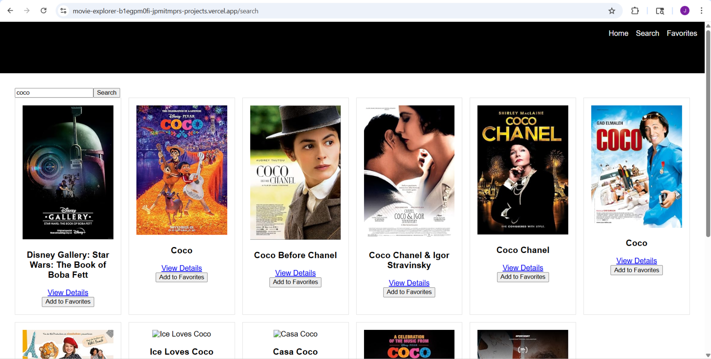

# Movie Explorer SPA

## 🚀 Live Demo

Check out the live deployed application here:

👉 https://movie-explorer-b1egpm0fi-jpmitmprs-projects.vercel.app

--- 

## 🧠 Project Description

Movie Explorer SPA is a **React Single Page Application** that lets users:

✅ Search for movies  
✅ View detailed movie information  
✅ Add movies to a personal **Favorites** list  
✅ Navigate through a fully responsive UI  
✅ Experience smooth client-side routing

This project uses the **OMDb API** to fetch real movie data and demonstrates key React concepts like routing, contexts, state management, and unit testing.

---

## 📌 Features

✔ 4+ Distinct Routes  
✔ Full Navigation with React Router  
✔ API Integration (OMDb)  
✔ Global State with React Context  
✔ Responsive Design for all screen sizes  
✔ Unit Tests with Vitest & React Testing Library  
✔ Deployed Online via Vercel  
✔ Clear Documentation and Version Control

---

## 🗺 Routes

| Route | Description |
|-------|-------------|
| `/` | Home page |
| `/search` | Search for movies |
| `/favorites` | View Favorites list |
| `/movie/:id` | Movie details page |
| `*` | 404 Not Found |

---

## 🛠 Tech Stack

- ⚛️ React  
- 🛠 Vite  
- 📦 React Router DOM  
- ☁️ Vercel Deployment  
- 📙 OMDb API  
- 🧪 Vitest + React Testing Library  

---

## 📥 Setup & Installation

1. Clone the repo:
   ```bash
   git clone https://github.com/YOUR_USERNAME/movie-explorer-spa.git
   cd movie-explorer-spa